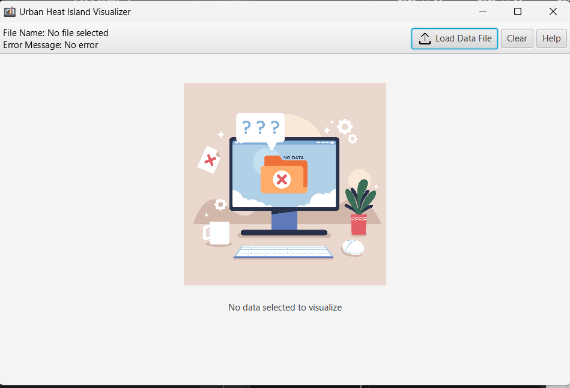

## Name of project: UHI Visualizer ##
* Names of authors: Jachin Hugh Dzidumor Kpogli, Curtis Atudedam Asizem, Adama Baba, Olivia Gyanwah Panford
* Date created: November 15, 2025
* Purpose: To display statistical information for a UHI (Urban Heat Island)
  
### Instructions on Usage ###
* Run the program to access the app's user interface using MainApp.java (located here: \uhi_visualizer\src\main\java\com\uhi_visualizer\MainApp.java). 
* The first page is as seen;
* 
* 
* 
* The following **components** can be seen: “Clear” button, “Upload File”, and “Help” buttons; Name of file selected and error message sections. 
* To get help on how to use the app, click the **Help** button for instructions and guidelines. This takes you to the GitHub repo.
* To successfully upload a file, click on the **"Upload File"** button located at the top right corner of the screen. You then select the file you want to upload. Ensure you select either a CSV file or a JSON file. If the CSV or JSON file you have selected contains an illegal number of columns or rows, or the labelling of the columns does not match the required fields, then you get an error message. An example of a successfully loaded file is as seen;
* 
* 
* 
* If an erroneous file was given, click the **“Clear”** button to clear the output, then click the “Upload File” button again to select the correct file. If the file selected does not contain any illegal arguments, then your file is analyzed and gives you the necessary descriptive statistical measures and graphs.  